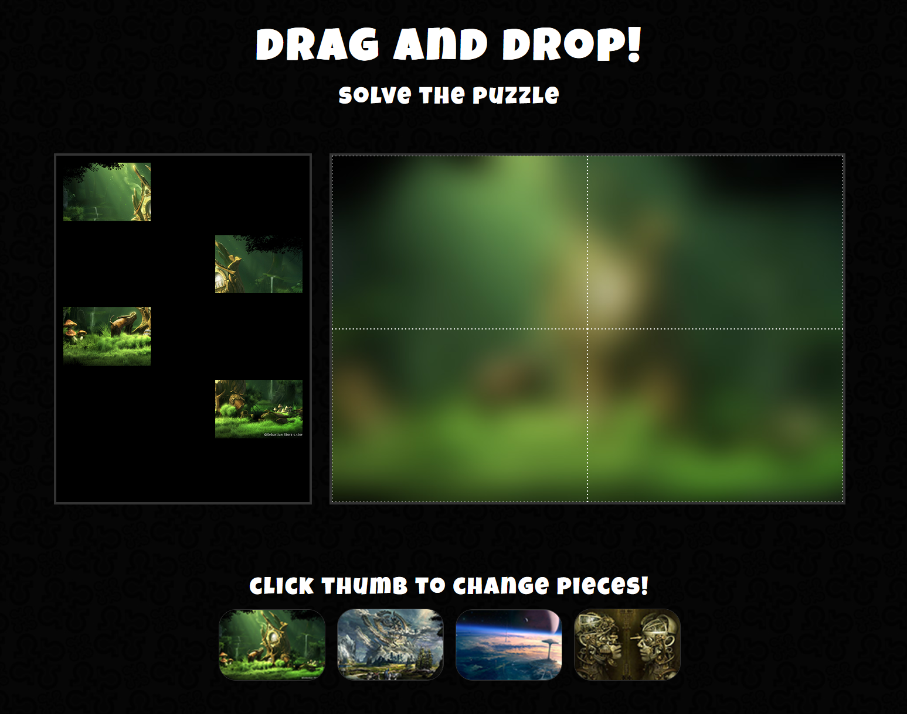

# Crushing Bugs

**Objective:** The objective of this project is to put my Javascript knowledge into practice and provide fixes for two bugs found on a Drag and Drop puzzle. Firstly, the puzzle pieces shouldn't overlap. Secondly, when choosing a new puzzle, the pieces should return to their original places.

## Installation
No installation required

## Usage
Just enjoy!

## Contributing
1. Fork it!
2. Create your feature branch: `git checkout -b my-new-feature`
3. Commit your changes: `git commit -am 'Add some feature'`
4. Push to the branch: `git push origin my-new-feature`
5. Submit a pull request :D

## History

February 2024

## Credits
Jenifer Quelali Evangelista

## License
MIT